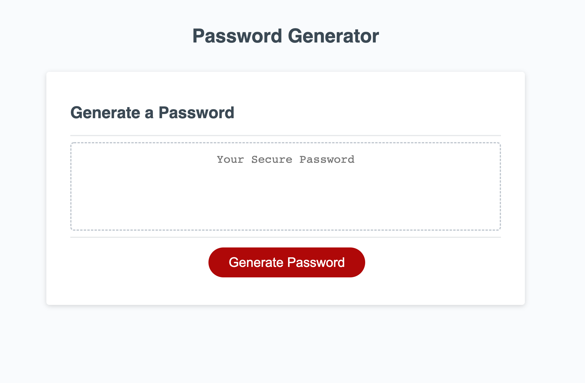

# Password Generator

## Description
This application creates a password automatically in several clicks.  The user clicks on a red button and is prompted with a series of questions.  Based upon the criteria chosen, a password between 8-128 characters is generated. 

N.B.: Bootcamp study project

## Features
The password must contain 8-128 characters.  If the initial number entered falls outside of these parameters, the prompt will refresh as indicated by the handleClick function.  

Once a valid number has been entered, the user is asked to confirm or deny (OK or cancel) whether or not to use lowercase, uppercase, numeric values, and special characters.

This application uses the Math.random function contained within a for loop to create spontaneous results.

Finally, the password is written into the textarea located above the button and underneath the page's subheading.

https://raposamillar.github.io/password-generator/

